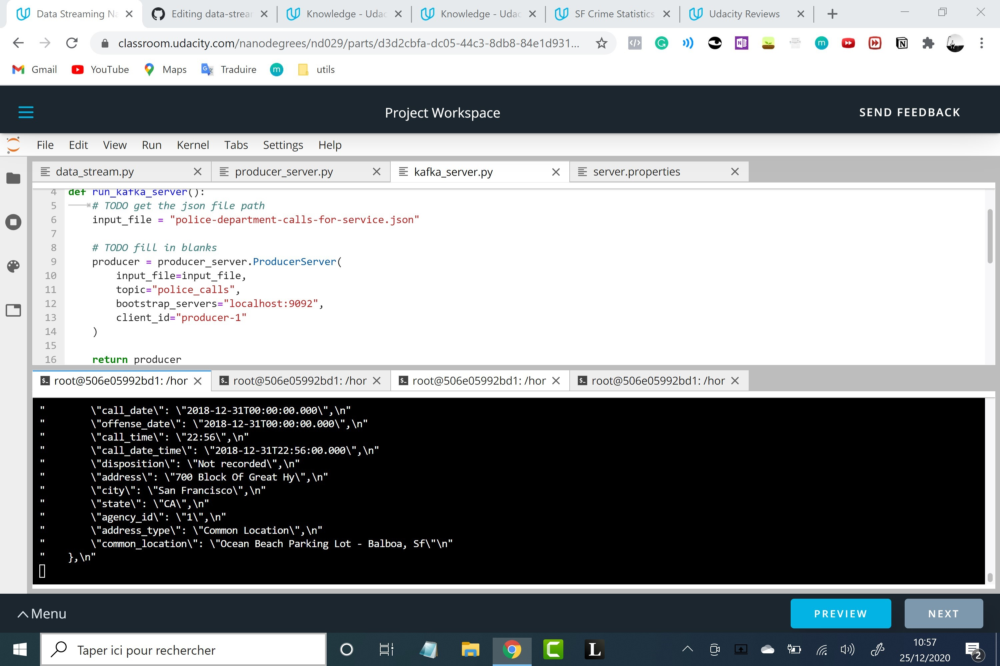

# data-streaming-project-spark-kafka

## Step 1

(1.) run `/usr/bin/zookeeper-server-start config/zookeeper.properties`, keep running, open new terminal
(2.) run `/usr/bin/kafka-server-start config/server.properties`, keep running, open new terminal
(3.) run `./start.sh`
(4.) run `python kafka_server.py`

## Run consumer CLI, take a screenshot
(5.) run `kafka-console-consumer --bootstrap-server localhost:9092 --topic police_calls --from-beginning`

## Step 2
(6.) 
