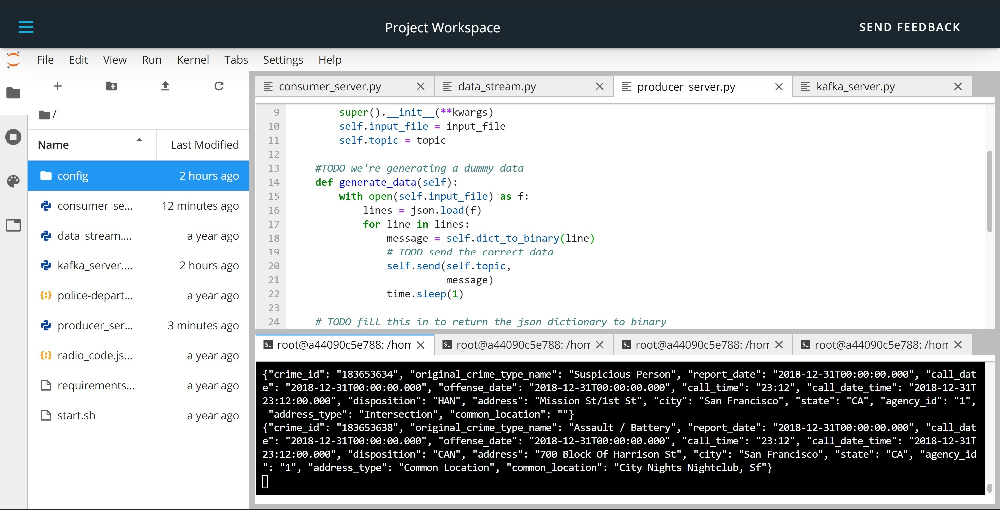
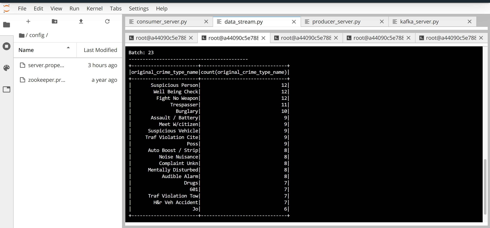
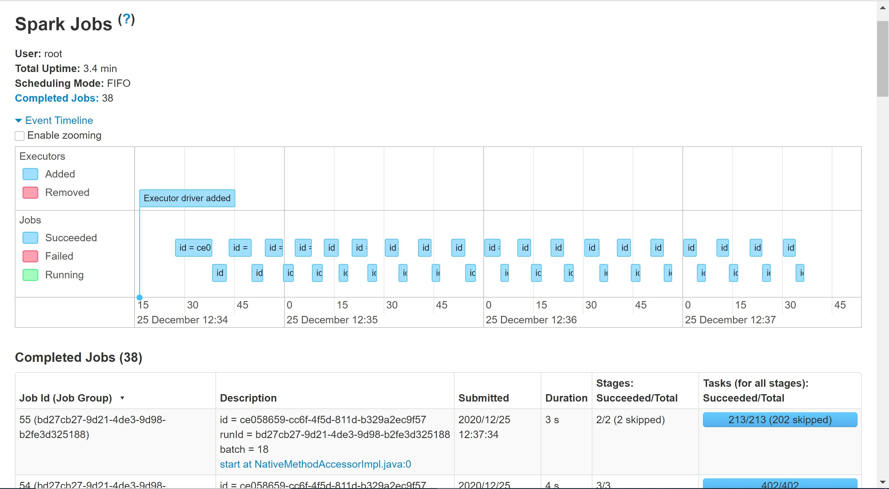

# data-streaming-project-spark-kafka

## Step 1

(1.) run `/usr/bin/zookeeper-server-start config/zookeeper.properties`, keep running, open new terminal

(2.) run `/usr/bin/kafka-server-start config/server.properties`, keep running, open new terminal

(3.) run `./start.sh`

(4.) run `python kafka_server.py`

## Run consumer CLI, take a screenshot
(5.) run `kafka-console-consumer --bootstrap-server localhost:9092 --topic police_calls --from-beginning`, kill it

## Step 2
(6.) run `spark-submit --packages org.apache.spark:spark-sql-kafka-0-10_2.11:2.3.4 --master local[*] data_stream.py > submit.log`, open a new terminal

(7.) run `tail -f submit.log`

(8.) open the Spark UI, click on "event timeline" to show the timeline

